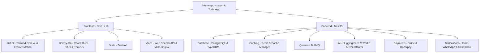

# 🌸 CODEBASE ANALYSIS - BEAUTY PARLÉ (MONOREPO)
**Date:** August 18, 2026  
**Project Name:** Beauty Parlé  
**Architecture:** Monorepo (Turborepo + PNPM Workspaces)  
**Main Apps:** Backend API (NestJS) & Frontend Web (Next.js 16)

---

## 📂 1. Core Architecture & Monorepo Configuration
The project is built as a high-performance JavaScript/TypeScript monorepo using **pnpm workspaces** and **Turborepo** for build caching and pipeline execution.

### Monorepo Setup Files:
1. **[`pnpm-workspace.yaml`](file:///d:/Desktop/Beauty%20Parl%C3%A9/pnpm-workspace.yaml)**:
   - Configures the workspace directories: `apps/*` and `packages/*`.
   - Whitelists specific build scripts for native modules like `@parcel/watcher`, `@swc/core`, `sharp`, `bcryptjs`, and `esbuild`.
2. **[`turbo.json`](file:///d:/Desktop/Beauty%20Parl%C3%A9/turbo.json)**:
   - Sets up build pipeline targets.
   - Enables topological execution dependency mapping so that shared packages build before apps.
3. **[`package.json` (Root)](file:///d:/Desktop/Beauty%20Parl%C3%A9/package.json)**:
   - Uses `pnpm@11.13.0` as the package manager.
   - Declares workspace scripts:
     - `pnpm dev`: Runs all applications (`turbo dev`) concurrently.
     - `pnpm build`: Compiles NestJS and Next.js projects.
     - `pnpm start:prod`: Launches backend server build output.
     - `pnpm migration:run` & `pnpm migration:generate`: Database migrations via TypeORM for the `api` filter.
4. **[`docker-compose.yml`](file:///d:/Desktop/Beauty%20Parl%C3%A9/docker-compose.yml)**:
   - Defines local Docker containers for development services:
     - **PostgreSQL (v15-alpine)**: Maps host port `5433` to container `5432`. Volumes database storage to `postgres_data`.
     - **Redis (v7-alpine)**: Maps port `6379`. Runs with security password authentication (`beauty-local-redis`).
5. **[`render.yaml`](file:///d:/Desktop/Beauty%20Parl%C3%A9/render.yaml)**:
   - Orchestrates infrastructure deployment configuration on Render.com, mapping backend environment bindings.

---

## 📊 2. Codebase File Statistics
Using static analysis, we counted **489 total source files** in the project (excluding compiled output and node modules).

### Extension Breakdown:
| File Extension | File Count | Purpose |
|---|---|---|
| `.ts` | 240 | Backend Logic, Services, Controllers, Entities, Configs |
| `.tsx` | 148 | Frontend Pages, Layouts, UI Components, 3D WebGL Views |
| `.json` | 23 | Build, Linter, Environment, and Shadcn Configurations |
| `.css` | 1 | Global CSS file |
| `.mjs` | 3 | ESLint config modules |
| `.yaml` / `.yml` / `.toml` | 8 | Workspace, Render, and Liveness triggers |
| `.jpg` / `.png` / `.webp` / `.svg` | 55 | Theme assets, static icons, look banners |
| `.local` / `.production` | 4 | Development and production environment profiles |
| **Total Files** | **489** | |

---

## 🧠 3. Backend Deep-Dive (apps/api - NestJS Framework)
The backend is structured into **50 NestJS modules** loaded in the main **[`app.module.ts`](file:///d:/Desktop/Beauty%20Parl%C3%A9/apps/api/src/app.module.ts)**. It utilizes **TypeORM** connecting to a **PostgreSQL** database, **Redis** for server-side caching and queues, and several **AI models**.

### Directory Structure of `apps/api/src`:
- `/config`: Configuration mapper loading environment variables dynamically.
- `/migrations`: Database schemas version history.
- `/modules`: Modular NestJS endpoints, services, and repositories.
- `app.controller.ts`, `app.service.ts`: Base routing controls.
- `data-source.ts`: TypeORM database connection options.
- `main.ts`: Entry bootstrap configuration.

---

### Analysis of all 50 NestJS Modules:
1. **`auth`**: Handles authentication. Includes Google OAuth, Facebook OAuth, JWT validation strategies, 2FA setup with `otplib` & QR codes, password hashing, and user throttler guards.
2. **`addresses`**: Stores and manages multi-address shipping book endpoints for users.
3. **`admin`**: System administrator console endpoint services, configuration controls, and administrative actions.
4. **`ai-assistant`**: Text and voice interactive system using Mistral models via OpenRouter. Operates tools for route navigation (`navigate_to`), product search (`get_products`), and web searches.
5. **`ai-chat`**: Endpoint for handling client dialogue sessions with the AI.
6. **`audit`**: Automated integrity scanner validating the relational mappings and health of tables.
7. **`audit-logs`**: Audit trail service tracking active logins, IP locations, browser user agents, and security alerts.
8. **`beauty-boxes`**: CRUD for customizable recurring cosmetic subscription boxes.
9. **`blog`**: Article creation, updates, and moderation. Holds commenting systems.
10. **`bundles`**: Combines multiple items for discounted product sets (e.g., matching makeup kits).
11. **`cart`**: Persistent database-level shopping cart caching.
12. **`chat`**: Real-time customer service socket gateway using Socket.io, connecting customers with administrative support.
13. **`checkout`**: Validates checkout states and creates payment integration objects.
14. **`comparison`**: Backing logic to fetch details of multiple items side-by-side.
15. **`coupons`**: Discount coupons validator, tracks usages limit, expiry, and dynamic percentage limits.
16. **`email`**: SMTP template builder sending confirmation notifications, 2FA codes, and marketing newsletters.
17. **`flash-sales`**: Timed promotion schedulers, overrides default pricing during designated intervals.
18. **`fraud`**: Security validation scanner checking order velocity, disposable email domains, and device signatures.
19. **`gamification`**: Achievement, badges, and points ledger management.
20. **`gdpr`**: Personal data downloader (generates client-profile CSV dumps) and manages right-to-be-forgotten deletion workflows.
21. **`inventory`**: Stocks monitoring, triggers backorders, and manages warehouse levels.
22. **`live-shopping`**: Dynamic socket controller broadcasting live sales presentation streams, chats, and active shopping links.
23. **`looks`**: Visual styling guides and cosmetic routines curated by experts.
24. **`loyalty`**: Customer rewards point-ledger and rewards redeemer.
25. **`marketing`**: Push notification hooks and advertisement campaign trackers.
26. **`notifications`**: Integrates Twilio API to dispatch order status changes directly to WhatsApp.
27. **`orders`**: Processes bookings/orders, builds PDF invoices, and tracks payment settlements.
28. **`payments`**: Handles Stripe and Razorpay integrations.
29. **`product-tags`**: Filters items by specific labels (e.g., Clean, Vegan, Organic).
30. **`products`**: Product listings, reviews, ratings, and image uploads.
31. **`quizzes`**: Stores answers to the beauty profile quiz and outputs customized suggestions.
32. **`recently-viewed`**: List tracking recently browsed items for each user profile.
33. **`recommendations`**: AI-driven recommendation module matching user skin types with suitable products.
34. **`redis`**: Centralized Redis configuration mapping key-value pools.
35. **`referrals`**: Direct referral links generator and tracks point rewards for successful sign-ups.
36. **`returns`**: Manages product return workflows, shipping labels, and approval processes.
37. **`roles`**: Implements Role-Based Access Control (RBAC) (Super-Admin, Admin, Customer).
38. **`routines`**: Generates skincare routine logs.
39. **`security`**: Security controls, CORS validations, and input validation pipes.
40. **`semantic-search`**: Vectors-based semantic search engine utilizing Hugging Face embeddings.
41. **`sessions`**: Tracks active JWT tokens and sessions, allowing users to terminate sessions remotely.
42. **`skin-analysis`**: AI Skin analyzer checking photos via Hugging Face Vision Transformers (ViT).
43. **`social`**: Holds share counts, likes, and social media integration configs.
44. **`subscriptions`**: Handles monthly membership cycles for cosmetic boxes.
45. **`support`**: Supports ticketing systems and reply trackers.
46. **`tiktok`**: Grabs user reviews and video feeds directly from TikTok API hooks.
47. **`ugc`**: Moderates user-generated photos and reviews.
48. **`waitlist`**: Manages back-in-stock alerts.
49. **`wishlist`**: Stores favorited items for users.
50. **`wishlist-alerts`**: Dispatches notifications during price drops or stock refills.

---

### 🛡️ Backend Security Architecture
Security is built into the core API configuration in **[`main.ts`](file:///d:/Desktop/Beauty%20Parl%C3%A9/apps/api/src/main.ts)**:
1. **SSRF (Server-Side Request Forgery) Protection**:
   - Implemented in the `skin-analysis` service.
   - Restricts URLs to `http`/`https` protocols.
   - Rejects local/private hostnames (`localhost`, `.local`, `.internal`) before running DNS lookups.
   - Resolves domains and rejects connections to resolved private IP ranges (IPv4 & IPv6).
   - Blocks automated redirect follows by forcing `redirect: 'manual'` and restricts files to 10MB.
2. **CORS Validation**:
   - Matches incoming origins dynamically.
   - Restricts Vercel preview environments behind an explicit environment flag (`CORS_ALLOW_VERCEL_PREVIEWS === 'true'`).
   - Supports local development dynamic ports.
3. **Helmet Header Protections**:
   - Enforces a Content Security Policy (CSP), allowing scripts only from self, Stripe, and Razorpay.
   - Restricts images to verified hosts (Unsplash, Cloudinary, Self).
4. **Rate Limiting**:
   - Custom rate limiting using `@nestjs/throttler` maps request thresholds to clients.
   - Configures trust proxy to ensure accurate client IP logging.
5. **Secure Configuration Policies**:
   - Refuses to start without a verified `JWT_SECRET` and `DB_ENCRYPTION_KEY`.
   - Production builds force database SSL authentication checks (`DB_SSL_REJECT_UNAUTHORIZED !== 'false'`).

---

## 🎨 4. Frontend Deep-Dive (apps/web - Next.js App Router)
The client interface is built on **Next.js 16 (App Router)**. It uses **Tailwind CSS v4** for styling, **Zustand** for state management, and **Three.js (React Three Fiber)** for 3D visualizations.

### Routing Structure (`apps/web/src/app/[locale]/`):
Multi-lingual routing is managed via `next-intl` to support localized prefixes (e.g. `/en/products` or `/hi/products`).

- `/about`: Details about the brand.
- `/addresses`: Saved address manager.
- `/admin`: Control panel for product listings, order statuses, and support tickets.
- `/ai-history`: History of AI chats and skin analyses.
- `/auth`: Handles user login, registration, and OTP verification.
- `/beauty-box`: Interactive beauty box customizable builder.
- `/blog`: Educational skincare articles and guides.
- `/booking`: Salon appointment slot scheduler.
- `/cart`: Shopping cart list.
- `/categories`: Filter items by categories.
- `/checkout`: Stripe/Razorpay forms.
- `/clean-beauty`: Organic products page.
- `/compare`: Side-by-side comparison tables.
- `/contact`: Customer support forms.
- `/faq`: Common questions.
- `/flash-sale`: Live sale timer countdown layouts.
- `/gamification`: View points, active badges, and unlocked achievements.
- `/live-shopping`: Real-time streaming interface with sync-chat.
- `/looks`: Shop curated aesthetic styles.
- `/loyalty`: Loyalty rewards program dashboard.
- `/order-confirmation`: Displays success details post-transaction.
- `/orders`: User order history and invoice PDF download.
- `/preferences`: User skin preferences form.
- `/privacy`: Privacy terms.
- `/product`: Product details page.
- `/products`: Main shop directory with filter tools.
- `/profile`: Customer information dashboard.
- `/quiz`: Personalization questions wizard.
- `/referral`: Refer-a-friend program manager.
- `/returns`: Request return shipments.
- `/routine-builder`: Skincare routine builder.
- `/shipping`: Shipping rules.
- `/skin-analysis`: Upload photos for automated skin analyses.
- `/subscriptions`: Subscription status manager.
- `/super-admin`: Advanced privilege controls.
- `/support`: Tickets chat interface.
- `/terms`: Service agreements.
- `/tracking`: Interactive order delivery map.
- `/virtual-try-on`: Interactive 3D WebGL simulator using Three.js for trying on makeup looks virtually.
- `/wishlist`: Wishlisted items.

---

### 🎙️ Multi-Lingual Speech Synthesis & Recognition
In **[`voice.service.ts`](file:///d:/Desktop/Beauty%20Parl%C3%A9/apps/web/src/services/voice.service.ts)**, the application implements native client voice commands:
- **Speech Recognition**: Uses browser-native Web Speech API (`SpeechRecognition` / `webkitSpeechRecognition`) to capture search inputs.
- **Speech Synthesis**: Speaks messages back to the user via `SpeechSynthesisUtterance`.
- **Supported Indian Languages**: Localized to multiple languages:
  - English (`en-US`), Hindi (`hi-IN`), Bengali (`bn-IN`), Tamil (`ta-IN`), Telugu (`te-IN`), Marathi (`mr-IN`), Gujarati (`gu-IN`), Kannada (`kn-IN`), Malayalam (`ml-IN`), and Punjabi (`pa-IN`).
- **Synthesis Cleanup**: Strips markdown symbols (stars, hashtags, backticks) before synthesis output and uses natural-sounding voices at a adjusted rate (`0.9`) and pitch (`1.1`).

---

### 🕶️ 3D WebGL Viewer (React Three Fiber)
In **[`Product3DViewer.tsx`](file:///d:/Desktop/Beauty%20Parl%C3%A9/apps/web/src/components/3d/Product3DViewer.tsx)**, users can interact with 3D product models:
- **Realistic Materials**: Uses `meshPhysicalMaterial` with clearcoat, roughness (`0.15`), and metalness (`0.3`) settings. Creates an elegant gloss bottle body (`#E8A0BF`) and gold metal trim ring (`#D4AF37`).
- **Interactive Controls**: Users can drag to rotate and scroll to zoom using `OrbitControls` and `PresentationControls` from `@react-three/drei`.
- **Environment Lights**: Generates studio lighting presets using `Environment` and maps ground shadows using `ContactShadows`.
- **Micro-Animations**: The model floats and spins slowly (`useFrame`) for an interactive, modern user experience.

---

### ⚡ Client-Side State Management (Zustand Stores)
Located in `apps/web/src/store/`:
1. **`authStore.ts`**: Coordinates active login sessions, user roles, security tokens, and user profile state.
2. **`cartStore.ts`**: Handles adding/removing items, total prices, and quantities.
3. **`productStore.ts`**: Holds product catalogs, filtering values, search results, and details of selected items.
4. **`wishlistStore.ts`**: Synchronizes items in the wishlist with backend APIs.

---

## 🚀 5. Performance & UX Optimizations
1. **Lazy Loading Sections**:
   - Heavy sections on the home page (like `Categories` and `FeaturedProducts`) are lazy-loaded on the client using Next.js `dynamic` imports. This keeps the initial bundle size small.
2. **Scroll-Based Intersection Observers**:
   - Sub-sections are rendered only when the user scrolls near them (`IntersectionObserver` at `200px` margin), improving page load speed and metrics.
3. **Smart Embeddings Cache**:
   - The semantic search service processes embeddings once and stores them in Redis for 24 hours. This prevents redundant external API requests to Hugging Face, reducing latency and costs.
4. **Optimized Package Imports**:
   - Heavy libraries like `three`, `framer-motion`, `@react-three/fiber`, and `@react-three/drei` are optimized via dynamic imports config in `next.config.js`.

---

## 🛠️ 6. Technology Stack Summary
Here is a summary of the technologies powering the project:

- **Frontend**: Next.js 16, React 19, TypeScript, Tailwind CSS v4, Framer Motion, GSAP, Zustand, next-intl, Socket.io-client, Three.js, React Three Fiber, React Hook Form, Zod.
- **Backend**: NestJS 11, TypeORM, PostgreSQL, Redis, BullMQ, Passport, Helmet, `@google/generative-ai` (Gemini), Hugging Face Inference API, OpenAI client.
- **Infrastructure & Deployment**: Docker (local development databases), Turborepo, Render YAML pipelines.
- **Database**: PostgreSQL (relational storage) & Redis (session and query caching).

---
*Analysis completed successfully. All features, modules, files, and architectural elements are mapped.*
